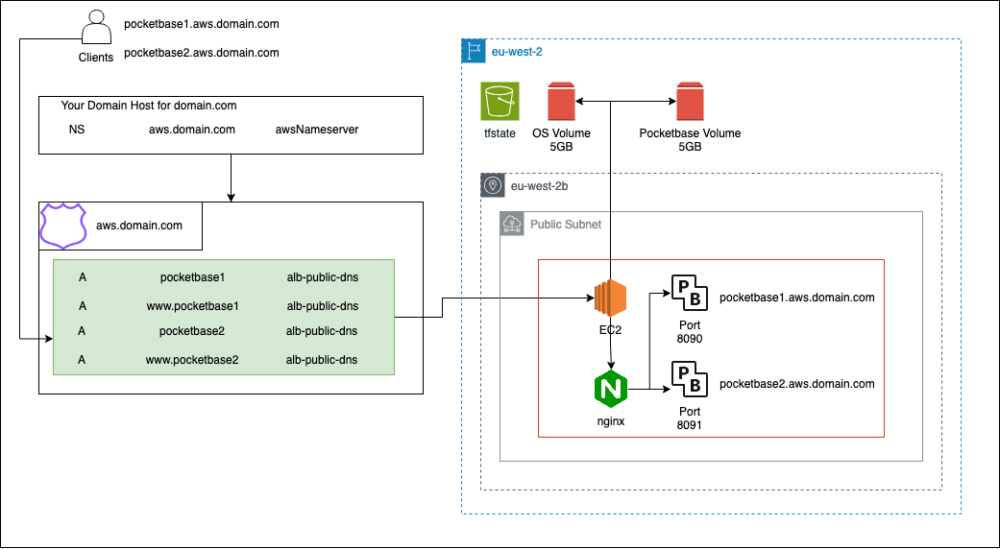

# aws

This terraform setup will deploy Pocketbase to a single EC2 instance and deploy it to a subdomain that you point at Route 53. It will redirect http to https traffic and manage the SSL certificate for you. 

Pocketbase will live on its own EBS volume, a snapshot of which will by default be taken every 24h and retained for 7 days. This is the only backup mechanism provided.

Pocketbase will be deployed to `pocketbase.yourdomain.tld`

You will still need to bring your own SMTP server. A start has been made to configure SES automatically, but it's still a WIP.

## Get set up

### With AWS

Sign into the AWS console.

To get the access keys, go to "Security Credentials" when signed into the root account. Run `aws configure` locally to get set up and insert the access key values in there. Delete those credentials once you're done - it is a bad practice for root credentials to exist.

Install terraform. It will use the default aws credentials stored on your machine.

Create an S3 bucket that will store your terraform state file. Either through the web console, or by using the [aws cli](https://docs.aws.amazon.com/cli/latest/userguide/getting-started-install.html). Do not allow this bucket to be publicly accessible.

## Terraform 

### Init

Get started with `terraform init`. If you changed the tfstate file location, add `-reconfigure`

bucket = name of the bucket you created earlier

key = name of your terraform state file: Use `terraform.tfstate` if unsure

region = the aws region you want to deploy into

### Plan

Run `terraform plan -out=tfplan` and pass any non-default values you wish to configure like this:

```
terraform plan 
-var="budget_max_amount=[amount in USD]"
-var="ebs_backup_frequency=[amount in hours]"
-var="ebs_backup_retention_days=[days]"
-out=tfplan
```

Any other variables will get prompted. The plan will get saved into a tfplan file

### Apply

Run `terraform apply tfplan` to load the previously constructed plan and apply it.

### Post-apply

If you ran apply for the first time, you will now need to configure your AWS subdomain. A hosted zone will have been created, and one of the DNS servers that will manage that zone will be output as `hosted_zone_nameserver`. With your domain host, you will need to create an NS record for the subdomain you provided with the provided nameserver as its value. Once this is in place, AWS will verify your domain ownership and it will soon become publicly accessible.

# Architecture

## Diagram


## Pricing estimate

Prices are based on eu-west-2 and updated as per October 2023

\+ Marks Free Trial

|Resource|Kind|Unit price|Monthly Price|Notes|
|-|-|-|-|-|
|EC2|Compute time (t4g.small)|$0.0168/h|$12.60|+ Free|
|Route 53|1 Hosted Zone|$0.50/domain|$0.50|
|ELB<br />Elastic Load Balancer|?|?|?|[Link](https://aws.amazon.com/elasticloadbalancing/pricing/)<br /> Application Load Balancer
|S3|Storage|$0.024/GB|$0.00|+ 5GB<br />Only used for tf state|
||Write|$0.0053/1000 requests|-|-|
||Read|$0.0053/1000 requests|-|-|
|EBS<br />Elastic Block Storage|Root volume|$0.0928/gb|$0.46|+ 30GB<br /> Minimum 5GB|
||App data|$0.0928/GB|$0.46|+ 30GB<br /> Minimum 5GB|
||Snapshots|$0.053/GB|$0.265|+ 1GB<br /> Only App data|
|Cloudwatch|No paid features|-|-|-|
|SES<br />Simple Email Service|Outbound from EC2|$0.10/1000 emails|$0.00|+ 3000 messages<br />In and outbound|
||Inbound|$0.10/1000 emails|$0.00|+ 3000 messages<br />In and outbound|
|SNS<br />Simple notification service|Messages|1 million free|$0.00|Then $0.50/million|
||||Estimates||
||Free Tier|Idle - No traffic|>= $0.50|Plus Tax|
|||Idle - No traffic|>= $14.28|Plus Tax|
